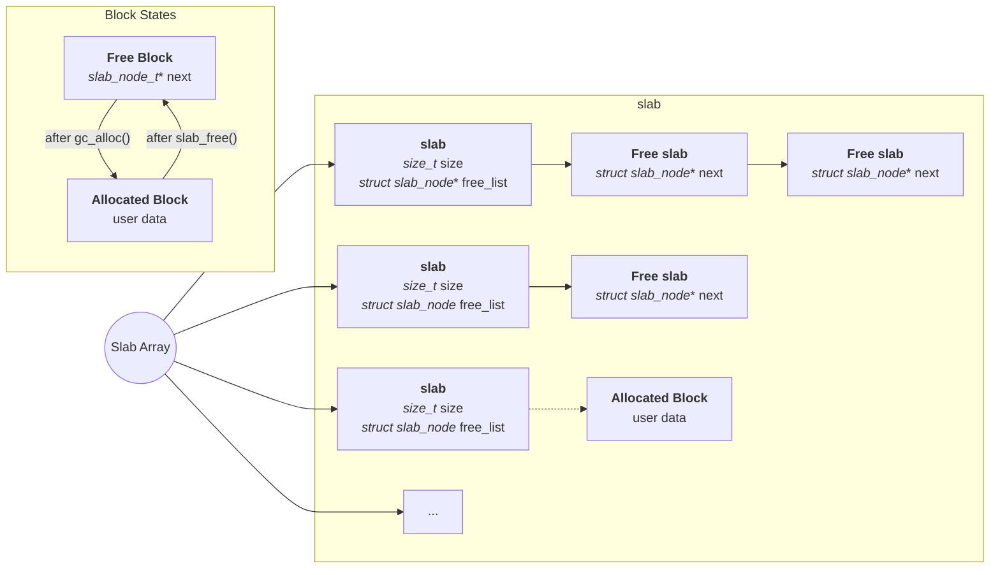
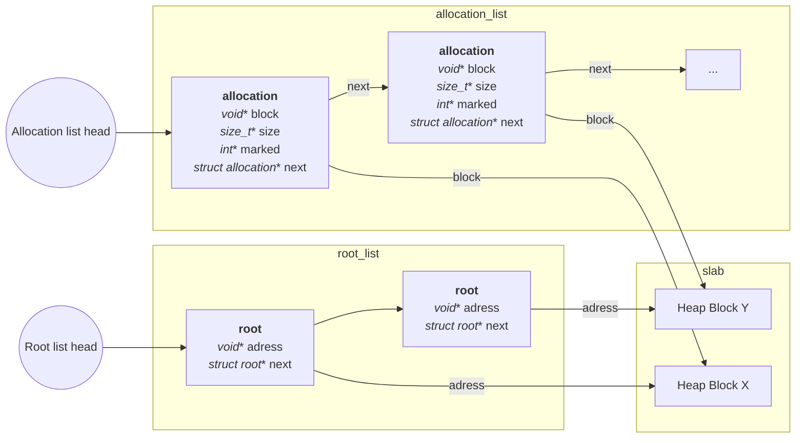

# Overview
A free list slab memory allocator written in C that implements `alloc` and `free`, combined with a mark-and-sweep garbage collector that uses manual root registration.

It supports both Unix and embedded builds. The slab allocator uses 7 fixed size classes from `8` bytes up to `512` bytes. The GC model is explicit: roots are manually registered with `gc_register_root`, and `gc_collect` traces from those roots.

# Architecture

The allocator side is a slab array with fixed size classes, where each slab keeps a free list for blocks of that class.
The GC side tracks roots and allocations in two linked lists, then `gc_collect` marks reachable blocks and sweeps the rest.


## The heap is laid out as follows: 

**NOTE** dotted line means same size class, block currently allocated NOT that there is a direct link.

## The GC: 



# API Reference

### `int slab_free(void* ptr, size_t size);`
Deallocates `size` bytes of memory connected to the pointer. Returns -1 on error and 0 on success.

### `void* slab_alloc(size_t size);`
Allocates `size` bytes of memory. Returns a pointer to the allocated block, or `NULL` on failure.

### `void slab_stats();` 
Prints a visualization of the slab heap using Unicode box drawing and ANSI colors. Lists the different block sizes, which blocks are allocated and free, and the total heap size.

### `int gc_register_root(void* ptr );`
Registers a root in the root list. The garbage collector keeps track of it and does not free it during `gc_collect`.

### `void* gc_alloc(size_t size);`
Allocates memory using `slab_alloc`, adds the new block to the `allocation_list`, and returns a pointer on success, otherwise `NULL`.

This does not add entries to the root list. Roots are registered separately with `gc_register_root`.

### `int gc_collect(void);` 
Runs mark-and-sweep collection.

Mark phase: walks from the root list and marks reachable allocation entries.
Sweep phase: walks the allocation list and frees everything that is still unmarked.

### `void gc_stats(void);` *(Unix only)*
Prints a visualization of the GC with one box for the root list and one box for the allocation list.

The root box shows currently registered roots, and the allocation box shows all GC-managed blocks and whether each block is marked/unmarked for collection.


# Design Decisions

Manual root registration:
The GC does not scan the C stack or globals automatically. You register roots with `gc_register_root`, which keeps behavior explicit.

`slab_free` takes a `size` parameter:
Blocks are managed by size class, so free needs the size to find the right free list quickly. This keeps free operations simple and avoids extra per block metadata.

Why 7 size classes:
The allocator uses fixed classes that double each step (`8, 16, 32, 64, 128, 256, 512`). This gives good coverage for small allocations while keeping fragmentation and list management manageable.

Why 512-byte max slab block:
The slab path is optimized for small and medium objects. Capping classes at `512` keeps lookup fast and memory overhead bounded, which is useful for embedded builds.


# Building and Running 

**Unix (default):**
```bash
make unit           # build and run unit tests
./build/unit_tests  # run unit tests
```


**Embedded:**
```bash
make unit_embedded  # build for embedded unit tests
```

Heap sizes can be specified with:
```bash
gcc -DUSE_EMBEDDED -DALLOCATOR_HEAP_SIZE=16384 ...
```

Note: `stats()` functions are only available on Unix builds since they depend on `printf` and ANSI escape codes.

Minimal usage in a project:
```c
void* p = gc_alloc(64);
gc_register_root(p);
/* use p */
gc_collect();
/* p is kept because it is a registered root */
```

# Known Limits

**Not thread safe** - The allocator uses global lists (`root_list` and `allocation_list`) with no locking. Concurrent access from multiple threads can corrupt both lists.

